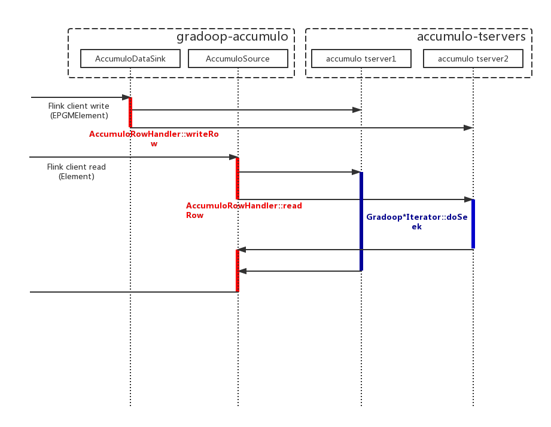

# Accumulo Store for Gradoop

[Apache Accumulo](https://accumulo.apache.org/) is a key/value store based on the design of Google's [BigTable](https://research.google.com/archive/bigtable.html). With this adapter implementation you can use Apache Accumulo as DataSource or DataSink for your graph data.

## Adding a Accumulo Runtime Iterator
Run the instructions below to build your accumulo runtime iterator:

```
cd gradoop-accumulo && mvn clean install
``` 

Then copy `gradoop-accumulo/target/gradoop-accumulo-<ver>.jar` to your accumulo runtime libs 
(native
 or 
hdfs).

If you use a native external lib , just copy it to `$ACCUMULO_HOME/lib/ext`.

For more details about accumulo, please visit [Apache Accumulo](https://accumulo.apache.org/).

## Creation of an Accumulo based Graph-store

```
// flink execution env
ExecutionEnvironment env = ExecutionEnvironment.createLocalEnvironment();

// create gradoop accumulo configuration
GradoopAccumuloConfig config = GradoopAccumuloConfig.create(env)  
  .set(GGradoopAccumuloConfig.ACCUMULO_USER, {user})
  .set(GGradoopAccumuloConfig.ACCUMULO_INSTANCE, {instance})
  .set(GGradoopAccumuloConfig.ZOOKEEPER_HOSTS, {comma separated zookeeper host list})
  .set(GGradoopAccumuloConfig.ACCUMULO_PASSWD, {password})
  .set(GGradoopAccumuloConfig.ACCUMULO_TABLE_PREFIX, {table prefix});

// create store
AccumuloStore graphStore = new AccumuloStore(config);
```

> let's just add some graph elements

```
graphStore.writeGraphHead(graphHead);
graphStore.wirteVertex(vertex);
graphStore.writeEdge(edge);

graphStore.flush();
```

## Accessing Data
> Example for DataSink & DataSource

```
// data source
DataSource accumuloDataSource = new AccumuloDataSource(config);
    
GraphCollection result = accumuloDataSource.cypher(
    "MATCH (u1:Person)<-[:hasModerator]-(f:Forum)" +
    "(u2:Person)<-[:hasMember]-(f)" +
    "WHERE u1.name = \"Alice\"");

// data sink
DataSink accumuloSink = new AccumuloDataSink(config);

accumuloSink.write(result);
```

## Store Implement

Here's the data flow about store implement:



- both `read`, `write` operations are spitted into multi ranges, which are pre-defined in accumulo 
tserver

- The changes of each `EPGMVertex/EPGMGraph/EPGMEdge` are made atomically.

See [accumulo_table_layout](../dev-support/store/accumulo_table_layout) for more detail
